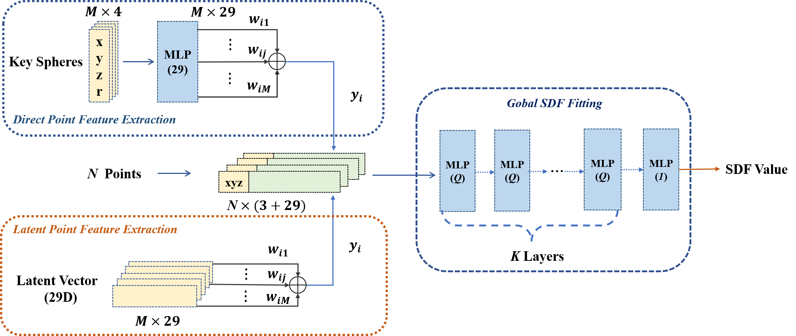

# Highly Compressed 3D Object Coding based on Key Spheres



## Getting started

### Ubuntu and CUDA version

We verified that it worked on ubuntu18.04 cuda10.2

### Python dependencies
The easiest way to get started is to create a virtual Python 3.6 environment via our environment.yml:
```
conda env create -f environment.yml
conda activate torch_over
cd ./submodules/miniball
python setup.py install

```
### Training
```
python train_series.py
```

### Evaluation
```
python eval.py
```
If you want to generate a reconstructed mesh through the MC algorithm
```
python modelmesher.py 
```

## Introduction
1. NeuralImplicit.py corresponds to the first architecture in the paper, NeuralImplicit_1.py corresponds to the second architecture.
2. We provide ball files for thingi10k objects.

## Third-Party Libraries

This code includes code derived from 3 third-party libraries

https://github.com/nv-tlabs/nglod
https://github.com/u2ni/ICML2021


