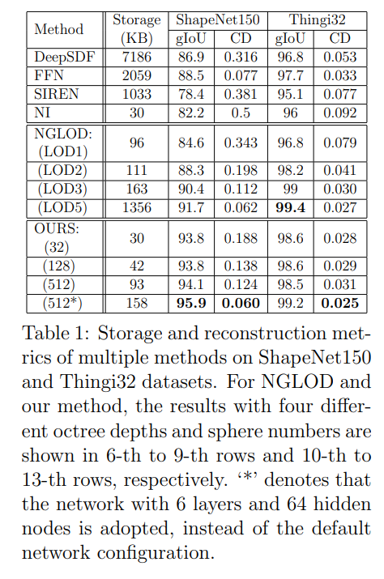

# High-fidelity 3D Model Compression based on Key Spheres

This repository contains the implementation of the paper:

Yuanzhan Li, Yuqi Liu, Yujie Lu, Siyu Zhang, Shen Cai∗, and Yanting Zhang. High-fidelity 3D Model Compression based on Key Spheres. Accepted by Data Compression Conference (DCC) 2022 as a full paper. [Paper pdf](https://arxiv.org/pdf/2201.07486.pdf)

## Methodology
Training a specific network for each 3D model to predict the signed distance function (SDF), which individually embeds its shape, can realize compressed representation and reconstruction of objects by storing fewer network (and possibly latent) parameters. However, it is difficult for the state-of-the-art methods NI [1] and NGLOD [2] to properly reconstruct complex objects with fewer network parameters. The methodology we adopt is to utilize explicit key spheres [3] as network input to reduce the difficulty of fitting global and local shapes. By inputting the spatial information of multiple spheres which imply rough shapes (SDF) of an object, the proposed method can significantly improve the reconstruction accuracy with a negligible storage cost. An example is shown in Fig. 1. Compared to the previous works, our method achieves the high-fidelity and high-compression coding and reconstruction for most of 3D objects in the test dataset.


As key spheres imply the rough shape and can impose constraints on local SDF values, the fitting difficulty of network is significantly reduced. Fig. 2 shows fitting SDF comparison of three methods to a 2D bunny image.


[1] Thomas Davies, Derek Nowrouzezahrai,  and Alec Jacobson,  “On the effectiveness ofweight-encoded neural implicit 3d shapes,” arXiv:2009.09808, 2020.

[2] Towaki Takikawa, Joey Litalien, Kangxue Yin, Karsten Kreis, Charles  Loop,  Derek Nowrouzezahrai, Alec Jacobson, Morgan McGuire, and Sanja Fidler, “Neural geometric level of detail:  real-time rendering with implicit 3d shapes,” in CVPR, 2021.

[3]  Siyu Zhang, Hui Cao, Yuqi Liu, Shen Cai, Yanting Zhang, Yuanzhan Li, and Xiaoyu Chi,   “SN-Graph:  a  minimalist  3d  object  representation  for  classification,” in ICME, 2021.

[4] M. Tarini, N. Pietroni, P. Cignoni, D. Panozzo, and E. Puppo, “Practical quad mesh simplification,” CGF, 29(2), 407–418, 2010.

## Network
In order to make a fair comparison with NI and NGLOD respectively, this 29D point feature can be extracted in direct and latent ways based on key spheres. The direct point feature extraction (DPFE, see the upper branch of Fig. 3) only uses a single-layer MLP (4∗29) to upgrade the 4D input of each key sphere to a 29D feature. The latent point feature extraction (LPFE, see the lower branch in Fig. 3) is similar to the latent feature of grid points in NGLOD. The 29D sphere feature vector is obtained by training, which is stored in advance.


## Experiment



## Results
For a mesh model, we provide the corresponding network model using DPLE branch. These models are trained with a 6∗32 MLP and 128 key spheres as input by default. The network model files are placed at ./results/models/, and their naming rules are a_b_c_d.pth, where a is the number of key spheres, b and c are the number and size of MLP layers, and d is the data name. If b and c are omitted, 6∗32 MLP is used. 

Some reconstructed mesh models are also provided. They are reconstructed using the 128-resolution marching cube algorithm. You can find them in ./results/meshes/. Three models are shown below. More reconstructed results in Thingi32 dataset can be seen in Release files. 


## Dataset
We use ShapeNet and Thingi10k datasets, both of which are available from their official website. Thingi32 is composed of 32 simple shapes in Thingi10K. ShapeNet150 contains 150 shapes in the ShapeNet dataset.
### ShapeNet
You can download them at https://shapenet.org/download/shapenetcore
### Thingi10k
You can download them at https://ten-thousand-models.appspot.com/
### Thingi32 and ShapeNet150
You can check their name at https://github.com/nv-tlabs/nglod/issues/4
## Getting started

### Ubuntu and CUDA version

We verified that it worked on ubuntu18.04 cuda10.2

### Python dependencies
The easiest way to get started is to create a virtual Python 3.6 environment via our environment.yml:
```
conda env create -f environment.yml
conda activate torch_over
cd ./submodules/miniball
python setup.py install

```
### Training
```
python train_series.py
```

### Evaluation
```
python eval.py
```
If you want to generate a reconstructed mesh through the MC algorithm
```
python modelmesher.py 
```

## Explanation
1. NeuralImplicit.py corresponds to the first architecture in the paper, NeuralImplicit_1.py corresponds to the second architecture.
2. We provide sphere files for thingi10k objects at ./sphere/thingi10kSphere/.
3. If you want to generate key spheres for your own models, check out https://github.com/cscvlab/SN-Graph

## Third-Party Libraries

This code includes code derived from 3 third-party libraries

https://github.com/nv-tlabs/nglod
https://github.com/u2ni/ICML2021

## License
This project is licensed under the terms of the MIT license (see LICENSE for details).
